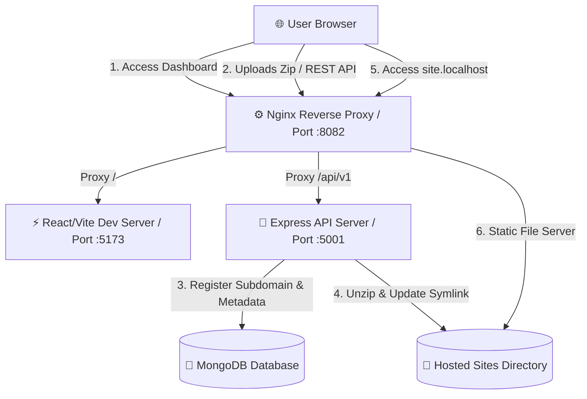
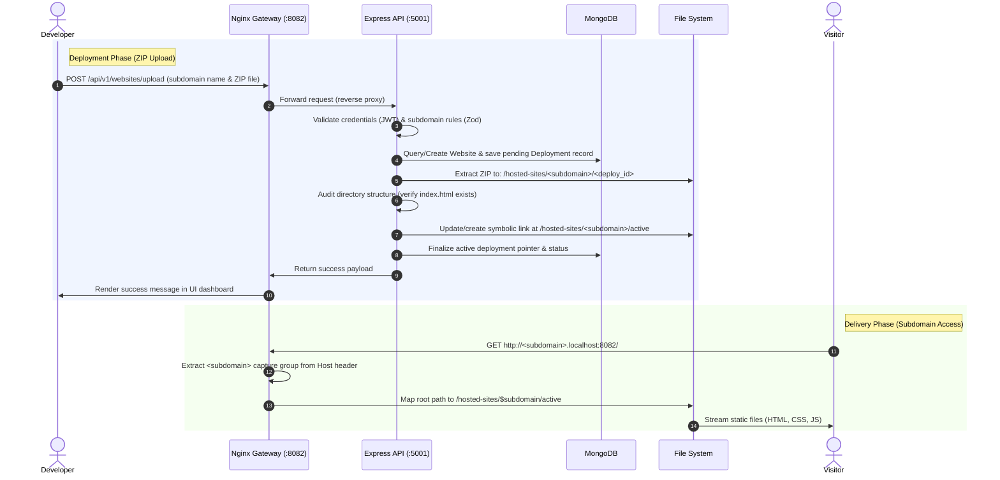

# ☁️ CloudNest

> **A Self-Hosted PaaS (Platform-as-a-Service) for Instant Static Website Hosting**

CloudNest is a self-hosted alternative to platforms like **Netlify** or **Vercel**. It allows developers to register, upload static web builds (ZIP archives), and deploy them instantly. The platform dynamically provisions subdomains (e.g., `my-site.localhost`) and path-based URLs with zero-downtime, atomic deployments powered by symbolic-link routing and a custom Nginx reverse proxy.

---

## 🛠️ System Architecture



---

## 🔄 Step-by-Step Execution Flow



---

## 🚀 Key Engineering Highlights (Great for Interviews!)

### 1. Atomic, Zero-Downtime Deployments (Symlink Routing)
* **Problem**: Extracting a ZIP file directly into a live web root directory can lead to partial reads, broken pages, and server errors during the extraction process.
* **Solution**: CloudNest implements **atomic versioned deployments** in [website.controller.js](file:///home/saif/cloudnest/backend/src/controllers/website.controller.js):
  1. The zip file is extracted into a versioned subdirectory: `hosted-sites/<subdomain>/<deployment_id>`.
  2. The folder structure is audited (checks for a valid `index.html`).
  3. A symbolic link named `active` (`hosted-sites/<subdomain>/active`) is atomically created or repointed to the new deployment folder.
  4. Nginx points directly to this symlink. Rollbacks and updates are instantaneous ($O(1)$ pointer swap) and risk-free.

### 2. Dynamic Wildcard Subdomain Routing via Nginx
* **Dynamic Configuration**: Rather than reloading Nginx configuration files for every new website deployment, Nginx is configured ([nginx.conf](file:///home/saif/cloudnest/ngnix/nginx.conf)) to extract subdomains dynamically using a regular expression:
  ```nginx
  server_name ~^(?<subdomain>[a-zA-Z0-9-]+)\.localhost$;
  ```
* **Dynamic Rooting**: The static files are served dynamically using Nginx's variable evaluation:
  ```nginx
  root /home/saif/cloudnest/hosted-sites/$subdomain/active;
  ```
* **Ngrok Friendly Fallback**: It maps path-based routes (e.g. `/sites/<subdomain>/active/`) to the static assets so developers can preview sites over free single-subdomain Ngrok tunnels.

### 3. User-Space Nginx Gateway
* In a production environment, Nginx usually runs as root. For local development and system safety, the Nginx configuration is tweaked to run in **user-space** by defining local paths for logs, PIDs, and temporary proxy caches (`client_body_temp_path`, `proxy_temp_path`, etc.). This allows the router to boot up without `sudo` privileges.

### 4. Robust API Security & Data Integrity
* **JWT Authentication**: Secured endpoints using custom JSON Web Token verification ([auth.middleware.js](file:///home/saif/cloudnest/backend/src/middleware/auth.middleware.js)).
* **Validation at the Boundary**: Implements input validation via **Zod** schema checking to enforce subdomain specifications (lowercase, dashes, and numbers only).
* **Database Modeling**: Models one-to-many relationships (User $\rightarrow$ Websites $\rightarrow$ Deployments) using MongoDB and Mongoose.

---

## 📂 Tech Stack

| Layer | Technology |
|---|---|
| **Frontend** | React, Vite, TailwindCSS |
| **Backend** | Node.js, Express, Multer, Zod, Adm-zip |
| **Database** | MongoDB, Mongoose |
| **Reverse Proxy** | Nginx (Dynamic Subdomains, WebSockets, Path Alias) |

---

## 🚦 REST API Endpoints

### 🔐 Authentication
* `POST /api/v1/auth/register` - Register a new account.
* `POST /api/v1/auth/login` - Authenticate user & receive JWT token.
* `GET /api/v1/auth/me` - Retrieve current user profile.

### 🌐 Website Deployments
* `GET /api/v1/websites` - Retrieve all websites owned by the user.
* `POST /api/v1/websites/upload` - Upload a `.zip` build file with a specified subdomain `name` to trigger a new deployment.

---

## 🏃 How to Run the Project Locally

### 1. Prerequisites
* **Node.js** (v18+)
* **MongoDB** (running locally or a remote connection string)
* **Nginx** (installed on your system path)

### 2. Setup Environment Variables
Create a `.env` file in the `backend/` directory:
```env
PORT=5001
MONGODB_URI=mongodb://127.0.0.1:27017/cloudnest
JWT_SECRET=your_jwt_super_secret_key
UPLOAD_DIR=/home/saif/cloudnest/uploads
HOSTED_DIR=/home/saif/cloudnest/hosted-sites
NODE_ENV=development
```

### 3. Run Development Services
In the root directory, run:
```bash
# Installs dependencies & starts frontend, backend, and Nginx router concurrently
npm run dev
```

* **Dashboard URL**: `http://localhost:8082`
* **Express API URL**: `http://localhost:8082/api/v1`
* **Hosted Websites Subdomains**: `http://<your-subdomain>.localhost:8082`
