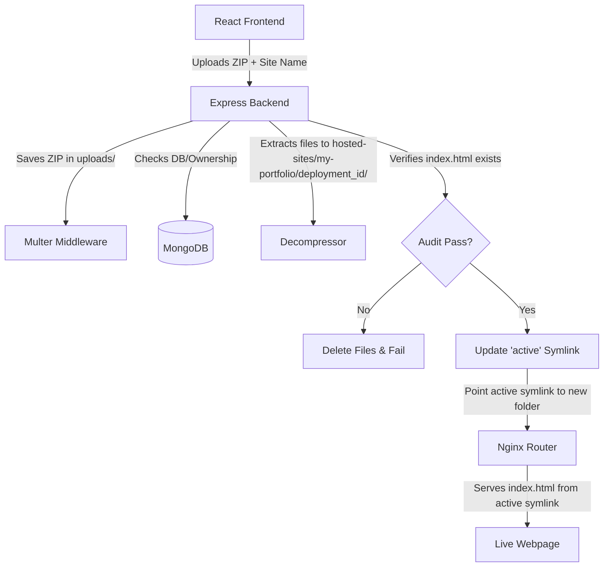

# CloudNest: Interview Cheat Sheet & Project Explanation

This document contains a comprehensive, easy-to-understand explanation of **CloudNest** designed to help you explain the project in detail during interviews.

---

## 1. High-Level Elevator Pitch
> *"CloudNest is a **DIY, self-hosted static site hosting platform**—similar to a mini-Vercel or Netlify. It allows users to upload a `.zip` file of their static website (HTML, CSS, JS), automatically extracts it, versions the deployments, and immediately routes traffic to it using Nginx. It features zero-downtime deployment updates using dynamic symbolic links (symlinks)."*

---

## 2. Core Architecture (How It Works)

The project consists of three main parts:
1. **Frontend (Vite + React)**: The dashboard interface where users log in, manage their websites, and upload zip files.
2. **Backend (Node.js + Express + MongoDB)**: Handles user authentication, file uploads, zip extraction, version control, and routing configuration.
3. **Router (Nginx)**: Runs in user-space to route requests. It does two things:
   - Proxies dashboard traffic to the frontend and API traffic to the backend.
   - Dynamically serves the active static files for hosted websites.

---

## 3. The Deployment Workflow (Step-by-Step)

When a user uploads a zip file named `portfolio.zip` for a site named `my-portfolio`:

1. **Upload**: React uploads the file. Express receives it using `multer`.
2. **Database Check**: The backend verifies if `my-portfolio` exists. If yes, it ensures the logged-in user owns it; if not, it registers it.
3. **Extraction**: The ZIP is extracted into `hosted-sites/my-portfolio/<deployment_id>/`.
4. **Validation (Audit)**: The backend checks if `index.html` exists in the extracted files. If it doesn't, the deployment is rejected and purged to prevent broken sites.
5. **Symlink Routing**: If valid, the backend creates/updates a symbolic link (`active`) pointing to the new deployment folder:
   `hosted-sites/my-portfolio/active` ➡️ `hosted-sites/my-portfolio/<deployment_id>/`
6. **Instant Nginx Update**: Nginx is configured to serve the folder at `hosted-sites/my-portfolio/active`. Because it points to the symlink, the website updates instantly without needing to restart Nginx!

---

## 4. Key Files & Folder Structure

Here is how the project files are organized and what each one does:

### 📁 Nginx Configuration Router
*   [`nginx.conf`](file:///home/saif/cloudnest/ngnix/nginx.conf): **The Gateway & Router**.
    *   It acts as a reverse proxy, forwarding standard traffic to React (Vite) and `/api` requests to Express.
    *   It handles wildcard subdomain routing (e.g., `http://my-site.localhost:8082/`) and serves files directly from the `hosted-sites/$subdomain/active` folder.
    *   *Interview Highlight*: It is configured to run in **user-space**, meaning it writes logs and PIDs to `/home/saif/cloudnest/ngnix/` and doesn't require root (`sudo`) privileges to run.

### 📁 Express Backend (`backend/src/`)
*   [`server.js`](file:///home/saif/cloudnest/backend/src/server.js): The entry point that boots up the server and listens on port `5001`.
*   [`app.js`](file:///home/saif/cloudnest/backend/src/app.js): Configures Express middleware (CORS, JSON parsers, Morgan logging) and defines the API endpoints.
*   [`config/database.js`](file:///home/saif/cloudnest/backend/src/config/database.js): Establishes the connection to MongoDB using Mongoose.
*   [`models/user.model.js`](file:///home/saif/cloudnest/backend/src/models/user.model.js): Schema for user authentication details (passwords are hashed using `bcrypt`).
*   [`models/website.model.js`](file:///home/saif/cloudnest/backend/src/models/website.model.js): Schema for the website project. Links a unique name (e.g., `my-portfolio`) to its `owner` and records the ID of the current `activeDeployment`.
*   [`models/deployment.model.js`](file:///home/saif/cloudnest/backend/src/models/deployment.model.js): Schema representing a single deployment run. Tracks status (`pending`, `deployed`, `failed`), the version number (e.g. `v1`, `v2`), file paths, and any deployment errors.
*   [`controllers/website.controller.js`](file:///home/saif/cloudnest/backend/src/controllers/website.controller.js): **The core business logic**. Handles file uploads using Multer, coordinates database transactions, triggers zip extraction, audits files, and updates symlinks.
*   [`utils/fileExtractor.js`](file:///home/saif/cloudnest/backend/src/utils/fileExtractor.js): Contains utility functions that handle unzipping files, traversing folders to locate the main `index.html` file, and deleting directories if a build fails.

### 📁 React Frontend (`frontend/src/`)
*   [`pages/Dashboard.jsx`](file:///home/saif/cloudnest/frontend/src/pages/Dashboard.jsx): The main hub for the logged-in user. Displays a list of their websites, their current status (deployed/failed), and deployment versions.
*   [`components/DeployModal.jsx`](file:///home/saif/cloudnest/frontend/src/components/DeployModal.jsx): The popup modal that lets users enter a site name, drag-and-drop their website `.zip` archive, and tracks upload progress.

---

## 5. Impressive Key Concepts to Mention in an Interview

When explaining this project, highlight these technical design choices to showcase your backend engineering skills:

1.  **Symlink-Based Routing (Zero Downtime)**
    *   *Explain*: *"Instead of updating Nginx configuration files and reloading Nginx every time a user deploys a new version, I used symbolic links. Nginx is hardcoded to serve files from `.../hosted-sites/site-name/active`. When a user deploys `v2`, the backend extracts it to a new folder and simply repoints the `active` symlink to the `v2` folder. This takes microseconds, avoids Nginx reloads, and ensures zero downtime."*
2.  **User-Space Nginx Routing**
    *   *Explain*: *"To avoid security risks and permission issues, I configured Nginx to run entirely in user-space. This means the server process runs under the local user account (not root) and stores its PID and temp files inside the project directory, making it isolated and highly secure."*
3.  **Strict Build Auditing**
    *   *Explain*: *"To prevent users from deploying broken websites, the backend performs a build audit before finalizing a deployment. It unzips the files and checks if an `index.html` file exists in the root (or nested sub-folders). If no index file is found, it rolls back, cleans up the files, marks the deployment as 'failed', and logs the error, ensuring the live version remains untouched."*
4.  **Incremental Versioning & Rollback Capability**
    *   *Explain*: *"Every time a zip is uploaded, the database records it as a new deployment document linked to the website, incrementing the version counter. This structure makes it incredibly easy to add a 'Rollback' button in the future, as we keep previous folders intact and can simply change the symlink back to a previous deployment folder."*
